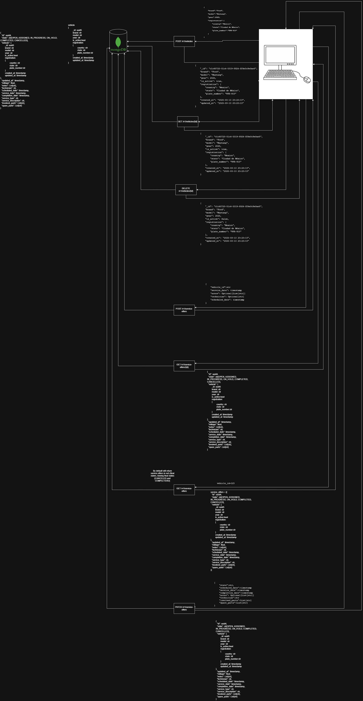

# Vehicle Service Orders API

This project provides an API for managing **Service Orders** related to vehicles. The system allows you to create, view, and manage service orders, but it has **minimal vehicle management** functionality. The focus is on **service orders**, not vehicle administration. The vehicle-related endpoints are limited to basic actions, such as creating and retrieving vehicle information. There is no full client or vehicle administration system.

## Key Features
- **Service Orders**: This is the core feature of the system. You can create and track service orders for vehicles.
- **Vehicle Management**: Basic vehicle management with limited features (create and retrieve vehicle info). Full vehicle administration is **not part of this system**.
- The system is base on state machines which at the moment are hardcoded, a great area of improvement could be loading them form a database or a cloud file.
  
## Important Notes
- This system **does not include client management**. 
- This system **does not contemplate payment management or description**.
- Vehicle management is **lightweight**; only essential vehicle creation and retrieval functionalities are implemented.
- Service Orders are the primary focus and the main feature of the system.

## API Documentation
- The API is documented using **Swagger UI**, and you can explore and test endpoints directly through the built-in interactive interface.
- A **Postman collection** is also available for easy import and testing of the API.

## Running with Docker

This repository contains a `Dockerfile` for easy deployment. To run the application using Docker, follow these steps:

### Prerequisites
- Docker must be installed on your machine.

### Steps
1. **Build the Docker image:**
   ```bash
   docker build -t vehicle-service-api .

2. **Run the Docker container:**
   ```bash
   docker run -d -p 5000:5000 vehicle-service-api .
   
3. **The API will now be accessible at http://localhost:5000. You can visit:**
   ```bash
   http://localhost:5000/docs to access the Swagger documentation and explore the available endpoints or refer to the local swwgger file located in "docs" folder.
   
## Endpoints Overview

### Vehicle Endpoints
- **`POST v1/vehicles/`**: 
  - Create a new vehicle.

- **`GET v1/vehicles/{id}`**: 
  - Retrieve an specific vehicle.

- **`DELETE v1/vehicles/{id}`**: 
  - Deactivates given vehicle.

### Service Order Endpoints
- **`POST v1/service-orders/`**: 
  - Create a new service order.
  - Request body: Service order details (e.g., vehicle information, description of the service, date).

- **`GET v1/service-orders/{id}/`**: 
  - Retrieve details of a specific service order by its ID.
  - Path parameter: `id` (ID of the service order).

- **`GET v1/service-orders/`**: 
  - List all service orders default filtered in non-final states.
  - Query parameters (optional): You can filter.

### Architecture


